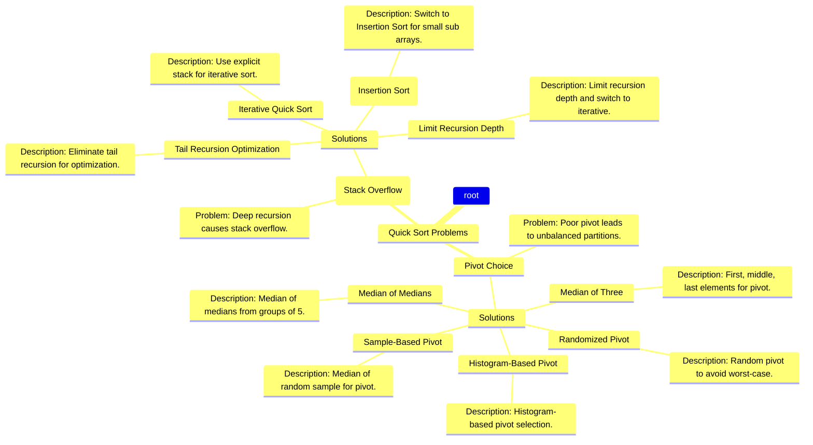

# How to make quick sort more interesting?

Quick Sort by nature is an interesting algorithm because of it divide and conquer nature 
and the complexity involved with recursive call. It has a time complexity of O(nlogn) and space complexity of O(nlogn) as well.

If we stop learning with how quick sort works and learning only the time and space complexity, we can never improve up on it.
Asking **"how to improve quick sort further is an interesting question and an interesting challenge?"** to embark on an interesting journey.

Many of us don't ask, as we have many performing sort algorithms, which are useful in various applications.
This exercise to ask simple questions and embarking on scientific investigation journey improves our acumen as well as our understanding.

Let us get started.

Quick sort starts with a pivot and divides the array into 2 sub arrays.
All the elements smaller than pivot are moved to left side sub array and all the larger elements are moved to right side sub array
with swapping. Then it calls itself recursively for both left and right sub arrays.

Here is an example program in java.
### General Quick Sort
```java
public class RecursiveQuickSort {
    // Main method to perform Quick Sort
    public static void quickSort(int[] arr, int low, int high) {
        if (low < high) {
            // Partitioning index
            int partitionedIndex = partition(arr, low, high);
            
            // Recursively sort elements before and after partition
            quickSort(arr, low, partitionedIndex - 1);
            quickSort(arr, partitionedIndex + 1, high);
        }
    }

    // Partition function to place pivot in correct position
    public static int partition(int[] arr, int low, int high) {
        int pivot = arr[high];
        int i = (low - 1); // Index of smaller element

        // Rearranging elements based on pivot
        for (int j = low; j < high; j++) {
            if (arr[j] <= pivot) {
                i++;
                swap(arr, i, j);
            }
        }

        // Swap the pivot element to the correct position
        swap(arr, i + 1, high);
        return i + 1;
    }

    // Swap utility function
    public static void swap(int[] arr, int i, int j) {
        int temp = arr[i];
        arr[i] = arr[j];
        arr[j] = temp;
    }

    // Helper function to print the array
    public static void printArray(int[] arr) {
        for (int num : arr) {
            System.out.print(num + " ");
        }
        System.out.println();
    }

    public static void main(String[] args) {
        int[] arr = {12, 4, 7, 9, 3, 10, 1, 8, 5, 2, 6};
        System.out.println("Original Array:");
        printArray(arr);

        quickSort(arr, 0, arr.length - 1);

        System.out.println("Sorted Array:");
        printArray(arr);
    }
}
```
Time complexity and space complexity reduced to O(nlogn) due to divide and conquer nature of the problem 
and due to its better planning and execution.

Instead of moving smallest or largest to its correct position before focusing on the remaining elements,
quick sort does a batch movement of elements, smaller elements to left and larger elements to right of pivot element.
This process puts many elements into its right position with its each move forward.

Quick sort is also an 'in memory' sorting algorithm. 
It does not require any additional memory based on number of elements or split. It makes it space efficient.

# How to improve Quick sort?
Is it possible to improve quick sort? In best case, `Quick sort` time complexity is O(nlogn).
Despite quick sort is a most efficient sorting algorithm, It is interesting to find ways to improve its performance.

By any chance can we improve performance further?

To improve quick sort performance, let us analyze where it performs best and where it performs worst.
We can also rely on scientific means based on data distribution or based on data convergence or precipitation.

1. Quick sort perform better in `large data set`. Function call occupy stack frames 
& consume time and partitioning consume time which is not beneficial in `smaller data set`.
More over small array can easily `fit in cache` of CPU processor, splitting it does not make sense.
2. Quick sort perform better in managing `cache memory` as `recursion stack` is the only memory required.
3. Quick sort also has the `best constant memory factor` as it does not require any additional memory 
based on number elements or split.
4. Quick sort cannot perform well in `nearly sorted array` or `partially sorted array` as it leads to unbalanced split.
5. Quick sort performs sorting by `splitting array`, it does not perform well when the split by pivot is unbalanced 
or does not have equal no. of elements on both sides of pivot.
6. The `choice of pivot` makes a difference in performance. We can choose the pivot based on data distribution 
or based on data convergence or precipitation.
7. Large recursion stacks can cause `stack overflow` in recursive quick sorts.
8. Quick sort's worst nightmare is `sorted array`, it can leave quick sort to run in O(n^2) time complexity, 
worst time complexity. At each split, the splitting is `unbalanced` and a `deeper recursion tree`, 
so it leads to O(n^2) time complexity.

Given these facts and understanding how data convergence takes place with pivot choice 
can we improve the performance of quick sort further in `smaller data set` or `nearly sorted` or `partially sorted` array?
can we improve the performance of quick sort further in `large data set`?
The main issues with quick sort seems to be `unbalanced splits`, `deepeer stacks` and `stack overflow`.

If we can make a good choice of pivot based on data distribution and data size,
we can further improve quick sort performance.
### How to choose a good pivot?
For balanced splits and to avoid deep recursion, we have to choose a good pivot based on available data and its distribution.
A good pivot is a pivot that splits the array in equal parts.
A median value is a good pivot but calculating median value is expensive. We usually choose the last element as pivot, 
rather than last or first or middle element. An `informed choice` of median of high, low and middle elements is better.

Here is an example program in java.
### Fixed Choice Median Pivot Quick Sort
```java
public class MedianOfThreeQuickSort {
    public static void medianOfThreeQuickSort(int[] arr, int low, int high) {
        if (low < high) {
            // Find the median-of-three pivot
            int pivotIndex = medianOfThreePivot(arr, low, high);
            // Partition the array and get the pivot index
            int pivotNewIndex = partition(arr, low, high, pivotIndex);
            // Recursively sort the sub arrays
            medianOfThreeQuickSort(arr, low, pivotNewIndex - 1);
            medianOfThreeQuickSort(arr, pivotNewIndex + 1, high);
        }
    }

    private static int medianOfThreePivot(int[] arr, int low, int high) {
        int mid = low + (high - low) / 2;
        // Compare the first, middle, and last elements and find the median
        if (arr[low] > arr[high]) swap(arr, low, high);
        if (arr[low] > arr[mid]) swap(arr, low, mid);
        if (arr[mid] > arr[high]) swap(arr, mid, high);
        // The median is at the middle index now
        return mid;
    }

    private static int partition(int[] arr, int low, int high, int pivotIndex) {
        int pivot = arr[pivotIndex];
        swap(arr, pivotIndex, high);  // Move pivot to the end
        int i = low - 1;
        for (int j = low; j < high; j++) {
            if (arr[j] <= pivot) {
                i++;
                swap(arr, i, j);
            }
        }
        swap(arr, i + 1, high);  // Place pivot in correct position
        return i + 1;
    }

    private static void swap(int[] arr, int i, int j) {
        int temp = arr[i];
        arr[i] = arr[j];
        arr[j] = temp;
    }

    public static void main(String[] args) {
        int[] arr = {7, 3, 5, 2, 9, 1, 6, 8, 4};
        medianOfThreeQuickSort(arr, 0, arr.length - 1);
        System.out.println(Arrays.toString(arr)); // Output: [1, 2, 3, 4, 5, 6, 7, 8, 9]
    }
}
```
We can also make random choice of pivot, thereby reducing the likelihood of unbalanced splits and deeper stacks.

Here is an example program in java.
### Random Pivot Choice Quick Sort
```java
import java.util.Random;

public class RandomizedQuickSort {
    private static final Random rand = new Random();

    public static void randomizedQuickSort(int[] arr, int low, int high) {
        if (low < high) {
            // Select a random pivot
            int pivotIndex = randomPivot(low, high);
            // Partition the array and get the pivot index
            int pivotNewIndex = partition(arr, low, high, pivotIndex);
            // Recursively sort the sub arrays
            randomizedQuickSort(arr, low, pivotNewIndex - 1);
            randomizedQuickSort(arr, pivotNewIndex + 1, high);
        }
    }

    private static int randomPivot(int low, int high) {
        // Random index between low and high (inclusive)
        return rand.nextInt(high - low + 1) + low;
    }

    private static int partition(int[] arr, int low, int high, int pivotIndex) {
        int pivot = arr[pivotIndex];
        swap(arr, pivotIndex, high);  // Move pivot to the end
        int i = low - 1;
        for (int j = low; j < high; j++) {
            if (arr[j] <= pivot) {
                i++;
                swap(arr, i, j);
            }
        }
        swap(arr, i + 1, high);  // Place pivot in correct position
        return i + 1;
    }

    private static void swap(int[] arr, int i, int j) {
        int temp = arr[i];
        arr[i] = arr[j];
        arr[j] = temp;
    }

    public static void main(String[] args) {
        int[] arr = {7, 3, 5, 2, 9, 1, 6, 8, 4};
        randomizedQuickSort(arr, 0, arr.length - 1);
        System.out.println(Arrays.toString(arr)); // Output: [1, 2, 3, 4, 5, 6, 7, 8, 9]
    }
}
```
Median of three pivot choice is better but can we also rely on other elements to choose a good pivot?
can we take median of medians of groups of five elements and choose the best medians? There is a calculation overhead. 
But it is an interesting approach.

Here is an example program in java.
### Median of Medians Pivot Choice Quick Sort
```java
public class MedianOfMediansQuickSort {
    public static void medianOfMediansQuickSort(int[] arr, int low, int high) {
        if (low < high) {
            int pivotIndex = medianOfMedians(arr, low, high);
            int pivotNewIndex = partition(arr, low, high, pivotIndex);
            medianOfMediansQuickSort(arr, low, pivotNewIndex - 1);
            medianOfMediansQuickSort(arr, pivotNewIndex + 1, high);
        }
    }

    private static int medianOfMedians(int[] arr, int low, int high) {
        int n = high - low + 1;
        if (n <= 5) {
            return partition5(arr, low, high);
        }

        // Group elements in chunks of 5
        for (int i = low; i <= high; i += 5) {
            int groupEnd = Math.min(i + 4, high);
            int medianOfGroup = partition5(arr, i, groupEnd);
            swap(arr, medianOfGroup, low + (i - low) / 5); // Store median in the beginning
        }
        int mid = (high - low) / 10 + low + (high - low) % 10;
        return medianOfMedians(arr, low, mid); // Recursively find the median of medians
    }

    private static int partition5(int[] arr, int low, int high) {
        // Sort the 5 elements and return the median
        Arrays.sort(arr, low, high + 1);
        return (low + high) / 2;
    }

    private static int partition(int[] arr, int low, int high, int pivotIndex) {
        int pivot = arr[pivotIndex];
        swap(arr, pivotIndex, high);  // Move pivot to the end
        int i = low - 1;
        for (int j = low; j < high; j++) {
            if (arr[j] <= pivot) {
                i++;
                swap(arr, i, j);
            }
        }
        swap(arr, i + 1, high);  // Place pivot in correct position
        return i + 1;
    }

    private static void swap(int[] arr, int i, int j) {
        int temp = arr[i];
        arr[i] = arr[j];
        arr[j] = temp;
    }

    public static void main(String[] args) {
        int[] arr = {7, 3, 5, 2, 9, 1, 6, 8, 4};
        medianOfMediansQuickSort(arr, 0, arr.length - 1);
        System.out.println(Arrays.toString(arr)); // Output: [1, 2, 3, 4, 5, 6, 7, 8, 9]
    }
}
```

can we take random elements instead of fixed elements to calculate median?

Here is an example program in java.
### Median from `Sampling` Pivot Choice Quick Sort
```java
import java.util.Arrays;
import java.util.Random;

public class SampleBasedPivotQuickSort {

    private static final Random rand = new Random();

    public static void sampleBasedQuickSort(int[] arr, int low, int high) {
        if (low < high) {
            // Select pivot using a sample of 5 elements
            int pivotIndex = getSamplePivot(arr, low, high);
            // Partition the array
            int pivotNewIndex = partition(arr, low, high, pivotIndex);
            // Recursively sort the sub arrays
            sampleBasedQuickSort(arr, low, pivotNewIndex - 1);
            sampleBasedQuickSort(arr, pivotNewIndex + 1, high);
        }
    }

    private static int getSamplePivot(int[] arr, int low, int high) {
        // Take a sample of 5 random elements from the subarray
        int sampleSize = 5;
        int[] sample = new int[sampleSize];
        int sampleStart = low + rand.nextInt(high - low - sampleSize);

        for (int i = 0; i < sampleSize; i++) {
            sample[i] = arr[sampleStart + i];
        }

        // Find the median of the sample
        Arrays.sort(sample);
        return sample[sampleSize / 2];  // Return median of the sample
    }

    private static int partition(int[] arr, int low, int high, int pivot) {
        int i = low - 1;
        for (int j = low; j < high; j++) {
            if (arr[j] <= pivot) {
                i++;
                swap(arr, i, j);
            }
        }
        swap(arr, i + 1, high);
        return i + 1;
    }

    private static void swap(int[] arr, int i, int j) {
        int temp = arr[i];
        arr[i] = arr[j];
        arr[j] = temp;
    }

    public static void main(String[] args) {
        int[] arr = {7, 3, 5, 2, 9, 1, 6, 8, 4};
        sampleBasedQuickSort(arr, 0, arr.length - 1);
        System.out.println(Arrays.toString(arr)); // Output: [1, 2, 3, 4, 5, 6, 7, 8, 9]
    }
}

```

can we analyse the data with histogram (relies on mode)? and then make a choice of pivot based on histogram?

Here is an example program in java.
### Histogram based Pivot Choice Quick Sort
```java
public class HistogramBasedPivotQuickSort {

    public static void histogramBasedQuickSort(int[] arr, int low, int high) {
        if (low < high) {
            // Select pivot using histogram-based method
            int pivot = getHistogramPivot(arr, low, high);
            // Partition the array
            int pivotNewIndex = partition(arr, low, high, pivot);
            // Recursively sort the sub arrays
            histogramBasedQuickSort(arr, low, pivotNewIndex - 1);
            histogramBasedQuickSort(arr, pivotNewIndex + 1, high);
        }
    }

    private static int getHistogramPivot(int[] arr, int low, int high) {
        // Create a histogram of the array values
        int[] histogram = new int[10];  // Assume values are in range 0-9
        for (int i = low; i <= high; i++) {
            histogram[arr[i]]++;
        }

        // Find the most frequent value (mode) or the median value
        int mode = 0;
        for (int i = 1; i < histogram.length; i++) {
            if (histogram[i] > histogram[mode]) {
                mode = i;
            }
        }

        return mode;  // Return the mode (or adjust to use median instead)
    }

    private static int partition(int[] arr, int low, int high, int pivot) {
        int i = low - 1;
        for (int j = low; j < high; j++) {
            if (arr[j] <= pivot) {
                i++;
                swap(arr, i, j);
            }
        }
        swap(arr, i + 1, high);
        return i + 1;
    }

    private static void swap(int[] arr, int i, int j) {
        int temp = arr[i];
        arr[i] = arr[j];
        arr[j] = temp;
    }

    public static void main(String[] args) {
        int[] arr = {7, 3, 5, 2, 9, 1, 6, 8, 4};
        histogramBasedQuickSort(arr, 0, arr.length - 1);
        System.out.println(Arrays.toString(arr)); // Output: [1, 2, 3, 4, 5, 6, 7, 8, 9]
    }
}
```
while we explored lot about choices, we should analyse which suits better and where? below is the summary of choices
and their advantages and disadvantages.

| Method                    | Description                                                               | Best Use Case                                                                                      | Time Complexity for Pivot Selection                |
|---------------------------|---------------------------------------------------------------------------|----------------------------------------------------------------------------------------------------|----------------------------------------------------|
| **Randomized Pivot**      | Randomly selects a pivot, reducing the likelihood of worst-case behavior. | When array order is unpredictable or could be nearly sorted.                                       | O(1)                                               |
| **Median of Three**       | Uses the first, middle, and last elements to select a pivot.              | When you need to prevent worst-case performance in sorted arrays.                                  | O(1)                                               |
| **Median of Medians**     | Selects the pivot as the median of medians of groups of five elements.    | When you need a guaranteed **O(n)** worst-case performance.                                        | O(n)                                               |
| **Sample-Based Pivot**    | Selects the pivot as the median of a small random sample of elements.     | When you want a good approximation of the median without sorting the whole array.                  | O(k) (where k is the sample size, typically small) |
| **Histogram-Based Pivot** | Uses a histogram to select a pivot based on the distribution of values.   | When the data distribution is known or can be reasonably assumed (e.g., skewed or clustered data). | O(n) (building histogram)                          |


### How to improve quick sort further? What about stack overflow handling?

Don't you think recursive quick sort algorithm is hard to read, debug and optimize?
We saw improving performance of quick sort is not an easy task, but we further ask some simple questions on
readability and maintainability.

Recursive algorithms usually have the following problems,
1. It can result in stack overflow
2. It can be hard to debug
3. It can be hard to optimize
4. It can be hard to parallelize
5. It can be hard to scale
6. It can be hard to test
7. It can be using memory inefficiently

Converting a recursive algorithm to a non-recursive iterative algorithm can help solve these problems.
Here is an example program in java.
### Iterative Quick Sort
```java
import java.util.Stack;

public class IterativeQuickSort {

    // Main method to perform Iterative Quick Sort
    public static void quickSort(int[] arr, int low, int high) {
        // Create a stack for storing sub arrays
        Stack<int[]> stack = new Stack<>();
        
        // Push the initial array boundaries onto the stack
        stack.push(new int[]{low, high});
        
        // Iterate while the stack is not empty
        while (!stack.isEmpty()) {
            // Pop the topmost subarray boundaries
            int[] range = stack.pop();
            low = range[0];
            high = range[1];
            
            if (low < high) {
                // Partitioning index
                int partitionedIndex = partition(arr, low, high);
                
                // Push the left subarray onto the stack
                stack.push(new int[]{low, partitionedIndex - 1});
                
                // Push the right subarray onto the stack
                stack.push(new int[]{partitionedIndex + 1, high});
            }
        }
    }

    // Partition function to place pivot in correct position
    public static int partition(int[] arr, int low, int high) {
        int pivot = arr[high];
        int i = (low - 1); // Index of smaller element

        // Rearranging elements based on pivot
        for (int j = low; j < high; j++) {
            if (arr[j] <= pivot) {
                i++;
                swap(arr, i, j);
            }
        }

        // Swap the pivot element to the correct position
        swap(arr, i + 1, high);
        return i + 1;
    }

    // Swap utility function
    public static void swap(int[] arr, int i, int j) {
        int temp = arr[i];
        arr[i] = arr[j];
        arr[j] = temp;
    }

    // Helper function to print the array
    public static void printArray(int[] arr) {
        for (int num : arr) {
            System.out.print(num + " ");
        }
        System.out.println();
    }

    public static void main(String[] args) {
        int[] arr = {12, 4, 7, 9, 3, 10, 1, 8, 5, 2, 6};
        System.out.println("Original Array:");
        printArray(arr);

        quickSort(arr, 0, arr.length - 1);

        System.out.println("Sorted Array:");
        printArray(arr);
    }
}
```

### Iterative Parallel Quick Sort
Now parallelism is easy to implement in Iterative Quick Sort.
Here is an example program in java.
```java
import java.util.Stack;
import java.util.concurrent.RecursiveTask;
import java.util.concurrent.ForkJoinPool;

public class ParallelIterativeQuickSort {

    // ForkJoinPool for parallel execution
    private static final ForkJoinPool pool = new ForkJoinPool();

    public static void parallelQuickSort(int[] arr, int low, int high) {
        // Create a stack for storing sub arrays
        Stack<int[]> stack = new Stack<>();
        
        // Push the initial array boundaries onto the stack
        stack.push(new int[]{low, high});
        
        // Iterate while the stack is not empty
        while (!stack.isEmpty()) {
            // Pop the topmost subarray boundaries
            int[] range = stack.pop();
            low = range[0];
            high = range[1];
            
            if (low < high) {
                // Partitioning index
                int partitionedIndex = partition(arr, low, high);
                
                // Create parallel tasks for the left and right sub arrays
                ParallelTask leftTask = new ParallelTask(arr, low, partitionedIndex - 1);
                ParallelTask rightTask = new ParallelTask(arr, partitionedIndex + 1, high);
                
                // Fork tasks to be processed in parallel
                pool.invoke(leftTask);
                pool.invoke(rightTask);
            }
        }
    }

    // Partition function to place pivot in correct position
    public static int partition(int[] arr, int low, int high) {
        int pivot = arr[high];
        int i = (low - 1); // Index of smaller element

        // Rearranging elements based on pivot
        for (int j = low; j < high; j++) {
            if (arr[j] <= pivot) {
                i++;
                swap(arr, i, j);
            }
        }

        // Swap the pivot element to the correct position
        swap(arr, i + 1, high);
        return i + 1;
    }

    // Swap utility function
    public static void swap(int[] arr, int i, int j) {
        int temp = arr[i];
        arr[i] = arr[j];
        arr[j] = temp;
    }

    // Helper function to print the array
    public static void printArray(int[] arr) {
        for (int num : arr) {
            System.out.print(num + " ");
        }
        System.out.println();
    }

    // Recursive task for parallel execution
    static class ParallelTask extends RecursiveTask<Void> {
        int[] arr;
        int low, high;

        ParallelTask(int[] arr, int low, int high) {
            this.arr = arr;
            this.low = low;
            this.high = high;
        }

        @Override
        protected Void compute() {
            // Partition the array and recursively handle sub arrays
            if (low < high) {
                int pi = partition(arr, low, high);
                ParallelTask leftTask = new ParallelTask(arr, low, pi - 1);
                ParallelTask rightTask = new ParallelTask(arr, pi + 1, high);

                // Fork tasks to run in parallel
                leftTask.fork();
                rightTask.fork();
                
                // Wait for the tasks to complete
                leftTask.join();
                rightTask.join();
            }
            return null;
        }
    }

    public static void main(String[] args) {
        int[] arr = {12, 4, 7, 9, 3, 10, 1, 8, 5, 2, 6};
        System.out.println("Original Array:");
        printArray(arr);

        parallelQuickSort(arr, 0, arr.length - 1);

        System.out.println("Sorted Array:");
        printArray(arr);
    }
}
```

| Algorithm                         | Short Description                                                                                   | Time Complexity                                                    | Space Complexity                                          | When to Use?                                                                                                                                                               |
|-----------------------------------|-----------------------------------------------------------------------------------------------------|--------------------------------------------------------------------|-----------------------------------------------------------|----------------------------------------------------------------------------------------------------------------------------------------------------------------------------| 
| **Recursive Quick Sort**          | Uses recursion to sort sub arrays by partitioning around a pivot element                            | Best-case: O(n log n), Average-case: O(n log n), Worst-case: O(n²) | O(log n) (due to recursion stack)                         | Typically used for large datasets due to its average-case efficiency, but can run into stack overflow with deep recursion on large or poorly partitioned arrays.           |
| **Iterative Quick Sort**          | Uses an explicit stack to simulate recursion, sorting sub arrays iteratively                        | Best-case: O(n log n), Average-case: O(n log n), Worst-case: O(n²) | O(n) (due to explicit stack)                              | Useful for environments with limited recursion depth or when stack overflow is a concern. It is also suitable for situations where recursion is not desirable.             |
| **Iterative Parallel Quick Sort** | Combines iterative approach with parallel processing to handle multiple sub arrays at the same time | Best-case: O(n log n), Average-case: O(n log n), Worst-case: O(n²) | O(n) (due to explicit stack), parallel execution overhead | Best for large datasets on multi-core processors, where performance can be improved by executing tasks concurrently. Suitable for modern hardware with multiple CPU cores. |


### Hybrid Quick Sort to handle recursion depth problem

In order to reduce the stack depth or recursion depth, 
when the sub array is reduced to smaller size we can use insertion sort to sort the sub array. 
It reduces the problem with recursion depth and leverages the best choice based on array size.

Here is an example program in java.
```java
import java.util.Stack;

public class HybridQuickSort {

    // Iterative part of Quick Sort
    public static void quickSortIterative(int[] arr, int low, int high) {
        // Stack to simulate recursion
        Stack<int[]> stack = new Stack<>();
        
        // Push the initial low and high index onto the stack
        stack.push(new int[] { low, high });
        
        // Process the stack iteratively
        while (!stack.isEmpty()) {
            int[] range = stack.pop();
            low = range[0];
            high = range[1];
            
            if (low < high) {
                // Partition the array
                int pi = partition(arr, low, high);

                // If the left subarray is larger, handle it recursively
                if (pi - 1 - low < high - pi + 1) {
                    stack.push(new int[] { low, pi - 1 });
                    stack.push(new int[] { pi + 1, high });
                } else {
                    // Else process the smaller subarray iteratively and the larger one recursively
                    stack.push(new int[] { pi + 1, high });
                    stack.push(new int[] { low, pi - 1 });
                }
            }
        }
    }

    // Partition function that places pivot at correct position
    private static int partition(int[] arr, int low, int high) {
        int pivot = arr[high];
        int i = low - 1;  // index of the smaller element

        for (int j = low; j < high; j++) {
            if (arr[j] <= pivot) {
                i++;
                swap(arr, i, j);
            }
        }

        swap(arr, i + 1, high);  // place the pivot in the correct position
        return i + 1;
    }

    // Helper method to swap two elements in an array
    private static void swap(int[] arr, int i, int j) {
        int temp = arr[i];
        arr[i] = arr[j];
        arr[j] = temp;
    }

    // Recursive function for small sub arrays (for hybrid approach)
    public static void quickSortRecursive(int[] arr, int low, int high) {
        if (low < high) {
            // Partition the array and get pivot index
            int pi = partition(arr, low, high);
            
            // Recursively sort the sub arrays
            quickSortRecursive(arr, low, pi - 1);
            quickSortRecursive(arr, pi + 1, high);
        }
    }

    // Method to print the array
    public static void printArray(int[] arr) {
        for (int num : arr) {
            System.out.print(num + " ");
        }
        System.out.println();
    }

    // Main method to test the hybrid approach
    public static void main(String[] args) {
        int[] arr = { 12, 4, 7, 9, 3, 10, 1, 8, 5, 2, 6 };
        
        System.out.println("Original Array:");
        printArray(arr);

        // Use the hybrid approach where the iterative part is used for large sub arrays,
        // and the recursive part is used for small sub arrays.
        quickSortIterative(arr, 0, arr.length - 1);

        System.out.println("Sorted Array:");
        printArray(arr);
    }
}
```

# Summary
In this post, we figured out how to make quick sort interesting, we found 2 problems unbalanced split with pivot choice 
and recursion depth in quick sort and how to solve them in different ways. 
Our investigation led us to many choices and solutions.



This **Markdown code** includes the full **Mermaid diagram** syntax for rendering a mind map with Quick Sort pivot selection methods,
stack depth issues, and their respective time and space complexities. You can paste this code into a **Mermaid-supported Markdown editor** to visualize it.

Happy Learning!